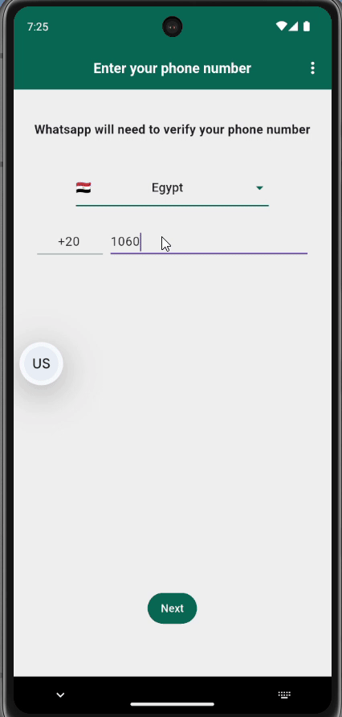
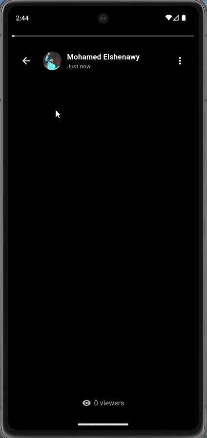
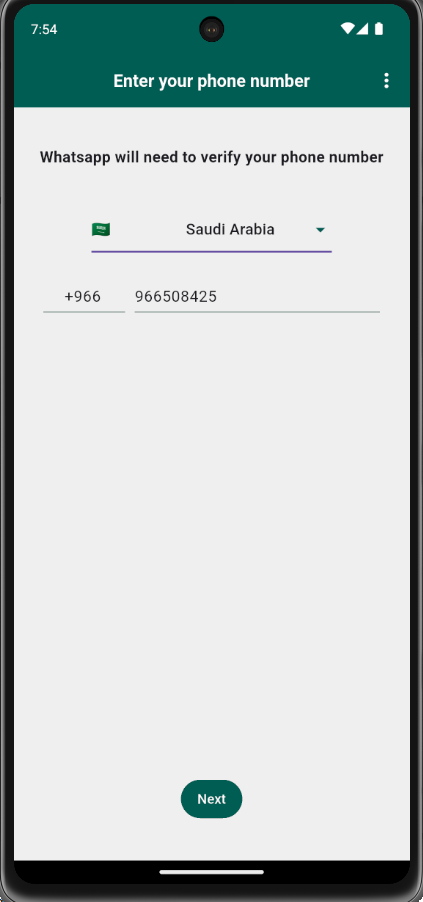
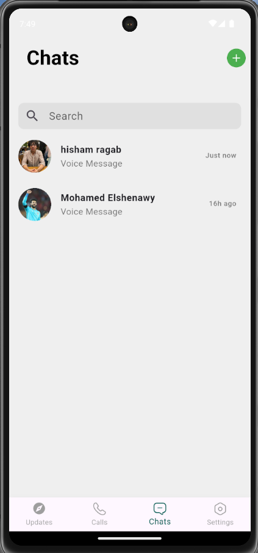
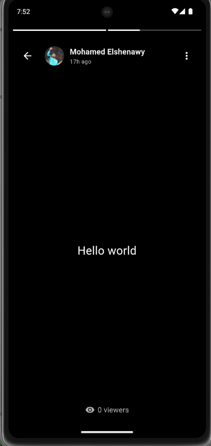
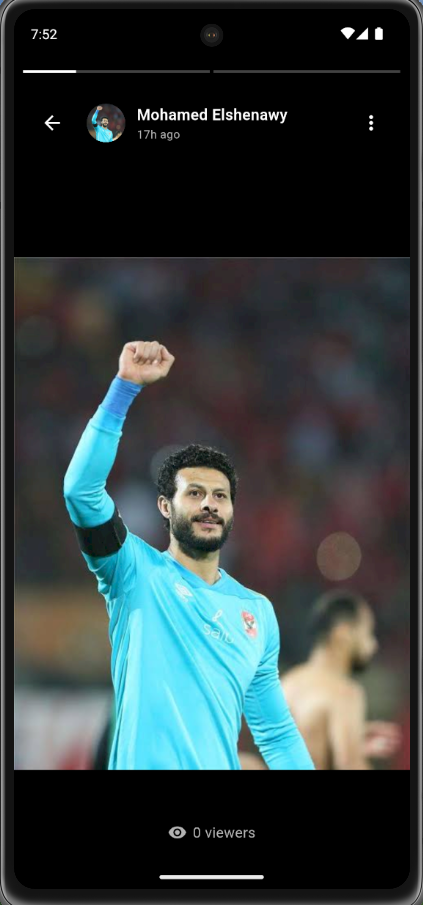

# WhatsApp Clone 📱

A modern WhatsApp clone built with Flutter and Firebase, featuring real-time messaging, voice messages, image sharing, stories, and push notifications.

## 📱 Demo

### Authentication


### Chat


### Status (Stories)


> **Note:** If the GIFs do not appear immediately on GitHub, it may be due to caching or large file size. Try refreshing the page after a few minutes.

### Screenshots

| Login | OTP | Chat List | Chat Detail |
|-------|-----|-----------|------------|
|  |  |  |  |

| Status List | Text Status | Image Status | Settings |
|-------------|------------|--------------|----------|
|  |  |  |  |

## ✨ Features

- 🔐 **Phone Authentication** - Secure login with OTP verification
- 💬 **Real-time Messaging** - Instant message delivery
- 🎤 **Voice Messages** - Record and send voice messages
- 📸 **Image Sharing** - Send photos in conversations
- 📱 **Stories** - Create and view 24-hour stories
- 🔔 **Push Notifications** - Get notified for new messages and stories
- 👥 **User Management** - Search and manage user profiles
- 🔍 **Search** - Search conversations and users

## 🚀 Quick Start

1. **Clone & Install**
   ```bash
   git clone https://github.com/hishamragab14/whatsapp_clone.git
   cd whatsapp_clone
   flutter pub get
   ```

2. **Firebase Setup**
   - Create Firebase project
   - Enable Authentication, Firestore, Storage, Cloud Messaging
   - Add configuration files

3. **Run**
   ```bash
   flutter run
   ```

## 🛠️ Tech Stack

- **Flutter** - UI Framework
- **Firebase** - Backend (Auth, Firestore, Storage, FCM)
- **GetX** - State Management
- **Dart** - Programming Language

---


Made with ❤️ by [Hisham Ragab]
